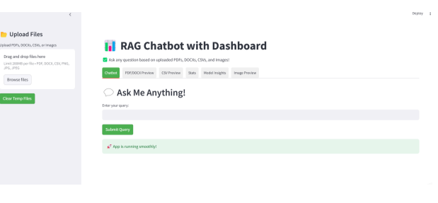
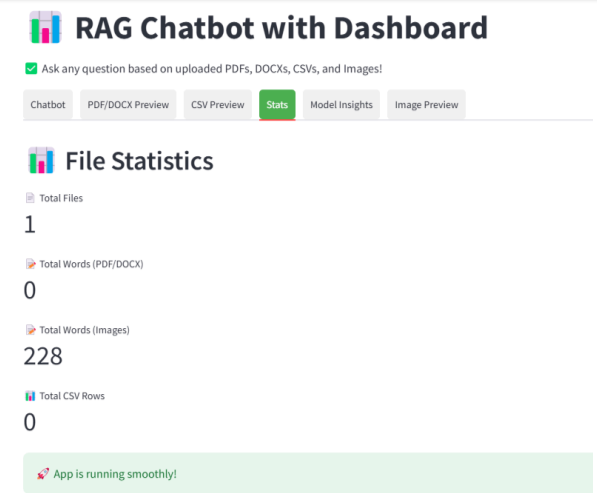

# QuestPro-AI

QuestPro-AI is an advanced AI-powered platform that enables users to upload PDFs, images, and videos, then ask questions based on the content. The system utilizes NLP models and deep learning techniques to extract and analyze information efficiently.

## 🚀 Features
- **PDF Q&A:** Extracts and processes text from PDFs for question-answering.
- **Text-Based QA:** Utilizes SentenceTransformer (`all-MiniLM-L6-v2`) and a BERT-based QA model (`bert-large-uncased-whole-word-masking-finetuned-squad`).
- **Efficient Search:** FAISS indexing for quick retrieval of relevant information.
- **Image Q&A:** Optical Character Recognition (OCR) for text-based analysis.
- **Video Q&A:** BLIP model integration for video-based question-answering.

## 🛠️ Tech Stack
- **Frontend:** Streamlit (for interactive UI)
- **Backend:** Python, Flask
- **AI Models:**
  - NLP: SentenceTransformer, BERT-based QA
  - Image Processing: OCR
  - Video Processing: BLIP
- **Database:** FAISS (for efficient similarity search)

## 📸 Screenshots




## 📂 Installation
1. **Clone the Repository**
   ```sh
   git clone https://github.com/divyaprabha1805/QuestPro-AI.git
   cd QuestPro-AI
   ```

2. **Install Dependencies**
   ```sh
   pip install -r requirements.txt
   ```

3. **Run the Application**
   ```sh
   streamlit run app.py
   ```

## 📢 Usage
- Upload PDFs, images, or videos.
- Ask questions based on the uploaded content.
- Get precise answers using AI-driven models.


